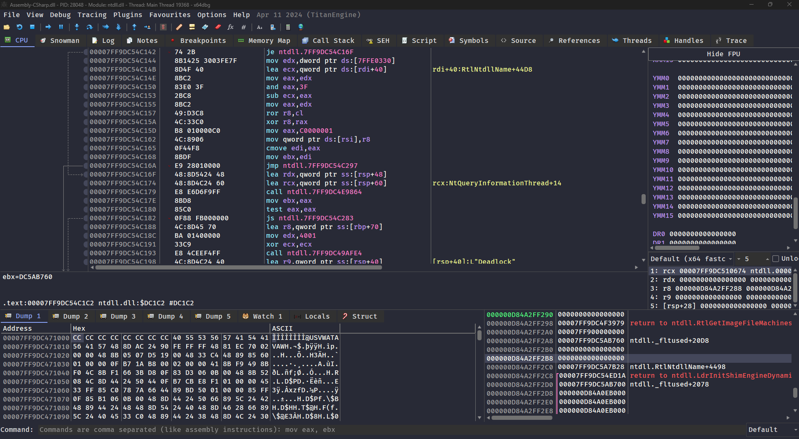

# Dracula for [x64dbg](https://x64dbg.com/)

> A dark theme for [x64dbg](https://x64dbg.com/).

## Install

1. Download the **Dracula** directory from this repository.
2. Copy the **Dracula** directory to the **x64dbg theme** directory. (e.g. `D:\x64dbg\release\themes\`)
3. Restart x64dbg and choose the **Dracula** theme from the **Options > Theme**.

## Team

This theme is maintained by the following person(s).

|       |
| ------------------------------------------------------------------------------------------ |
| [CX330's GitHub](https://github.com/CX330Blake) [CX330's Blog](https://blog.cx330.tw) |

## Community

-   [Twitter](https://twitter.com/draculatheme) - Best for getting updates about themes and new stuff.
-   [GitHub](https://github.com/dracula/dracula-theme/discussions) - Best for asking questions and discussing issues.
-   [Discord](https://draculatheme.com/discord-invite) - Best for hanging out with the community.

## Dracula PRO

## License

[MIT License](./LICENSE)
